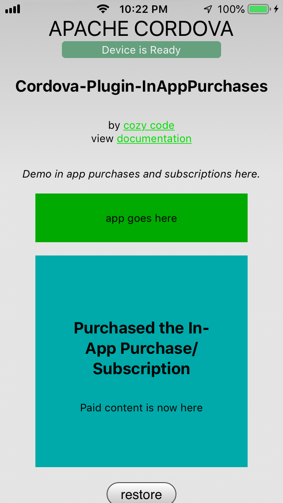

# Cordova-Plugin-InAppPurchases DEMO App

This a demo app with an implementation of in-app purchases and subscriptions. <br/>Demo a full app with an in-app purchase using  [**Cordova**](https://cordova.apache.org/) and [**cordova-plugin-inapppurchases**](https://github.com/cozycodegh/cordova-plugin-inapppurchases#Cordova-Plugin-InAppPurchases) by [cozycode.ca](cozycode.ca).

To run the demo app on any product id, follow these instructions to download and run the app:
1. Have your app idenifier string (eg. io.cordova.hellocordova) <br/>
    Log into the App Store Connect and Google Play to create your apps, make a "bundle identifier" (aka widget id, or app identifier)
2. Have create your product ids ready<br/>
    [See testing tips to create in-app products and subscriptions](https://github.com/cozycodegh/cordova-plugin-inapppurchases#testing-tips)
3. Create a cordova project to test in:
```
cordova create new_test_dir app.bundle.identifier.to.test
```
4. Add the in-app purchases plugin by `cozycodegh`:
```
cd new_test_dir
cordova plugin add cordova-plugin-inapppurchases
cd ..
```
4. Download this repository:
```
git clone https://github.com/cozycodegh/cordova-plugin-inapppurchases_DEMOAPP
```
5. Move the files into the cordova project test directory:
```
mv cordova-plugin-inapppurchases_DEMOAPP/* new_test_dir/
```
6. Edit the `www/js/index.js` file to include your product ids and edit notifications:
```
var product_id_1 = "ca.cozycode.non_consumable_product";
var enable_logging = true;
var enable_alert_logging = true;
```
  *  For Android, also create a `www/manifest.json` file with the `base64 billing key` in this test project:
```
{ "play_store_key": "<Base64-encoded public key from the Google Play Store>" }
```
7. Run the demo app on different platforms:
```
cordova platform add ios
cordova build ios
open platforms/ios/HelloCordova.xcworkspace
cordova platform add android
cordova run --device android
```

# Demo App Preview:
<p align="center">

</p>
<p align="center">

</p>


